基于Python的社区充值卡医院管理系统（程序+论文）
=
- 完整代码获取地址：从戎源码网 ([https://armycodes.com/](https://armycodes.com/))
- 作者微信：19941326836  QQ：952045282
- 承接计算机毕业设计、Java毕业设计、Python毕业设计、深度学习、机器学习
- 选题+开题报告+任务书+程序定制+安装调试+论文+答辩ppt 一条龙服务
- 所有选题地址https://github.com/nature924/allProject

一、项目介绍
---
基于Python实现的社区充值卡医院管理系统，目的在于满足医院内职工人员工作需求以及医院药品的管理需求等，主要功能如下。

### 管理员：
- 管理员可以查找、编辑或增加新用户、科室、医生、护士、药品、患者等信息。
- 在就诊记录板块，管理员可以查找特定患者的就诊记录
- 在收费中心板块，可以查找患者的医药费用信息。
- 管理员在缴费记录板块查找患者，对患者卡内进行充值等操作。

二、项目技术
---
- 编程语言：Python
- 项目架构：B/S架构
- 前端技术：ElementUI、Vue、Vuex、Axios、Vue-Router
- 后端技术：MySQL、Python、Flask、jieba，cnsenti

三、运行环境
---
- 操作系统：Windows、macOS都可以
- Python版本：3.7及以上都可以
- 操作系统：Windows7/10、MacOS
- 开发工具：IDEA、Ecplise、MyEclipse都可以
- 数据库: MySQL5.5/5.7/8.0版本都可以

四、运行截图
---
### 程序截图：
#### 医生端
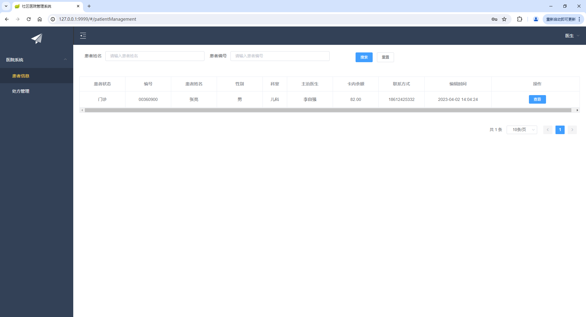

#### 药房端
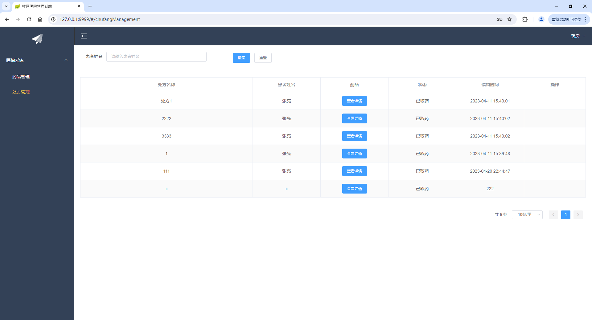
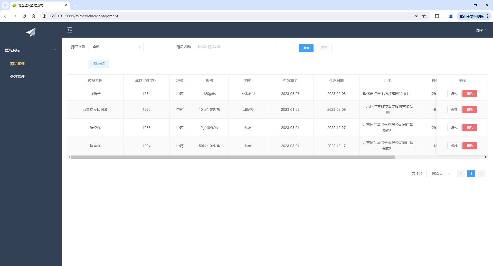
#### 管理端
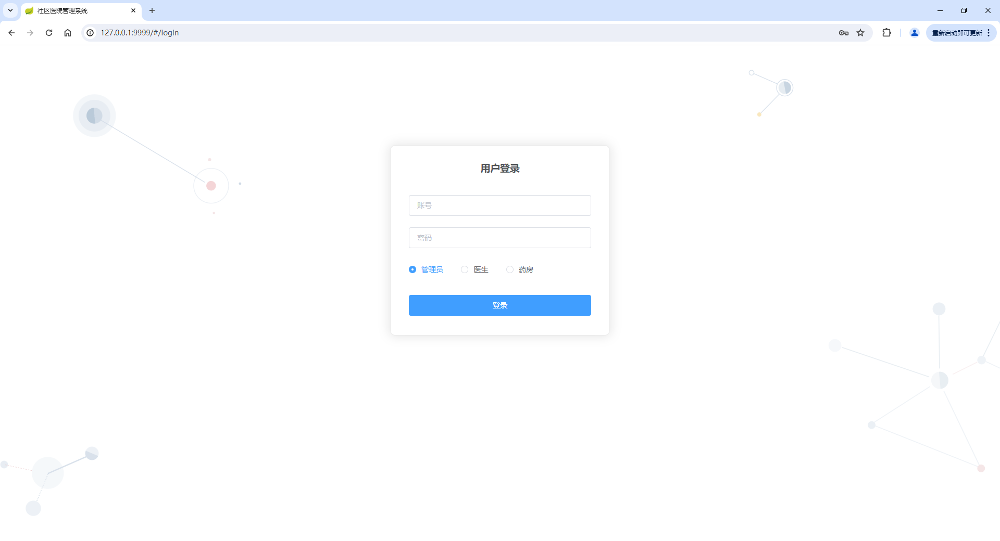
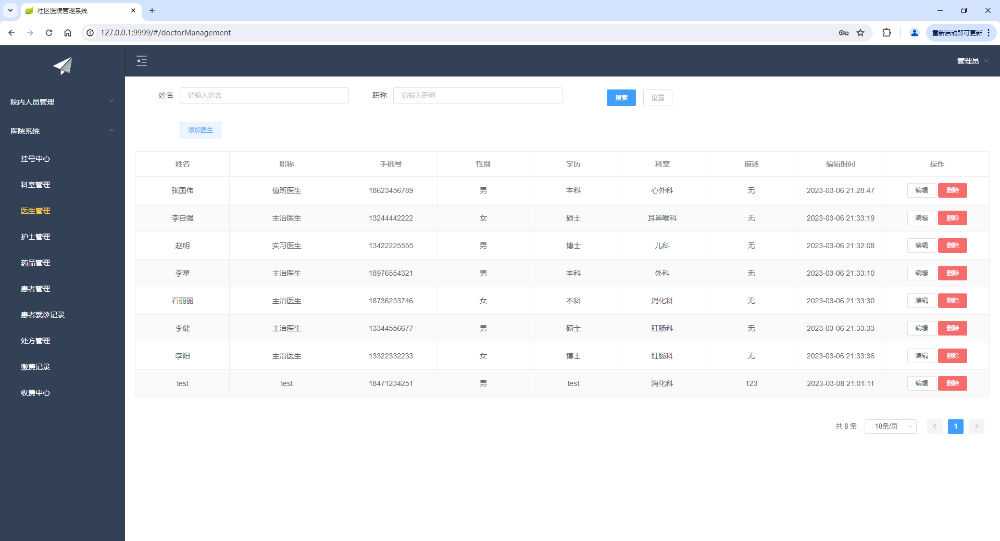
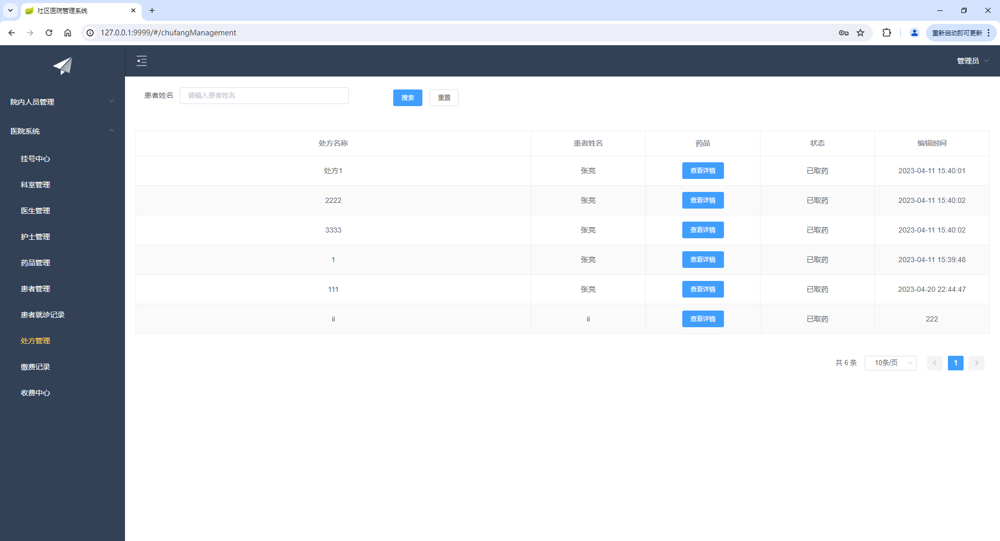
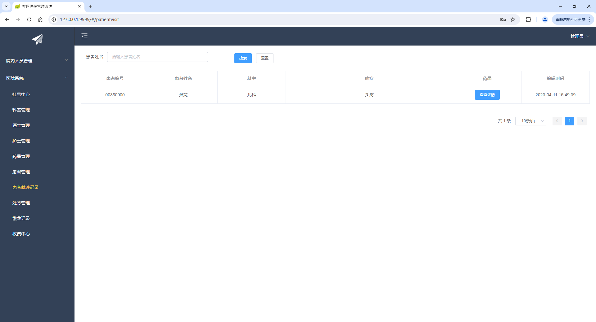
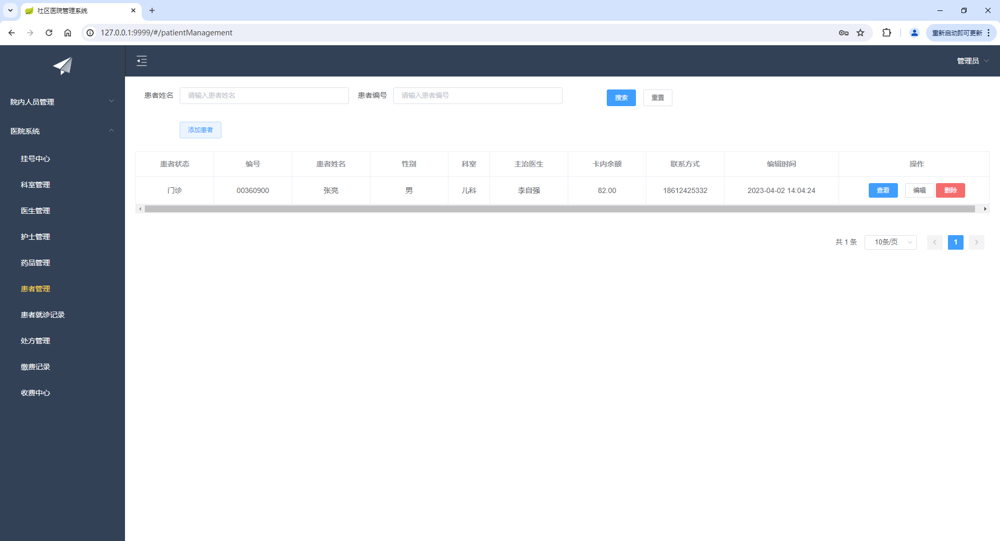
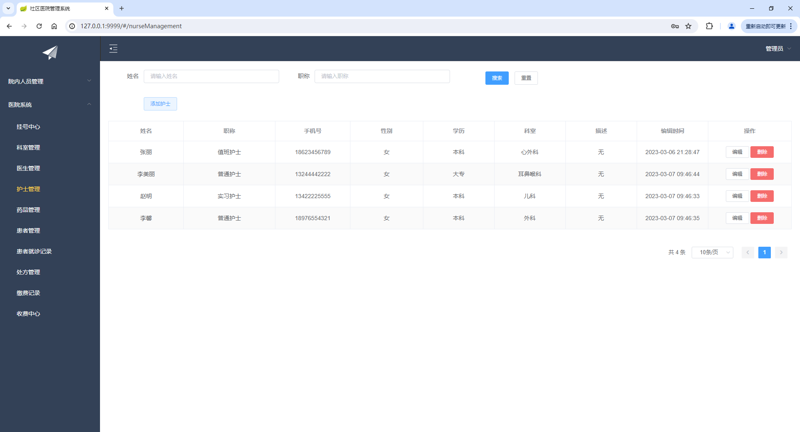
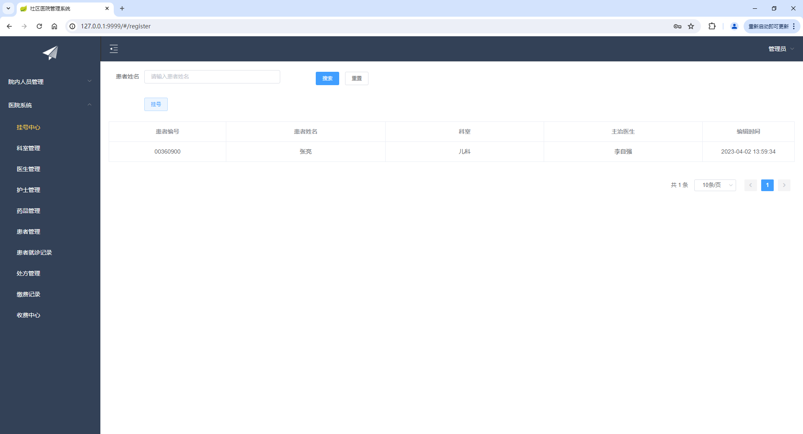
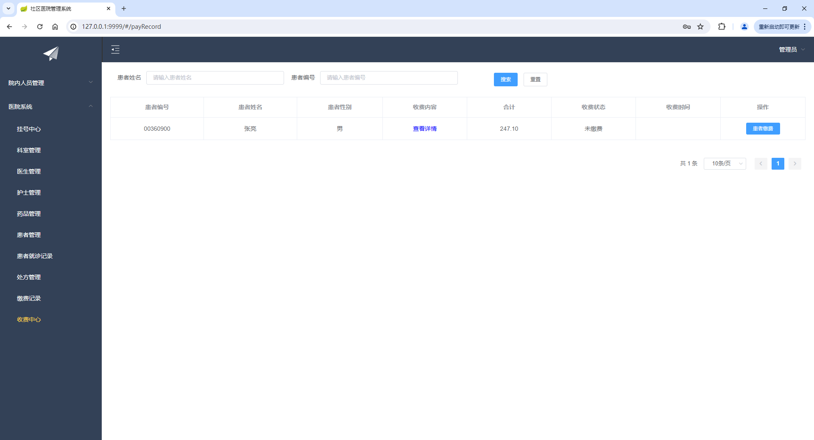

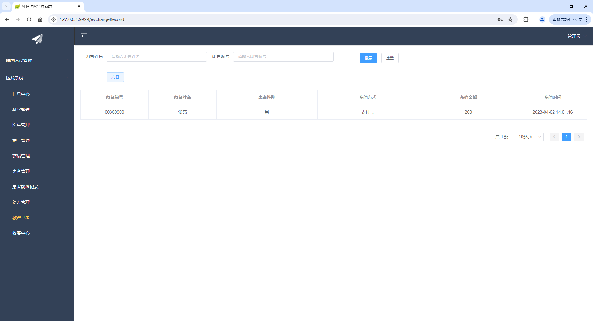

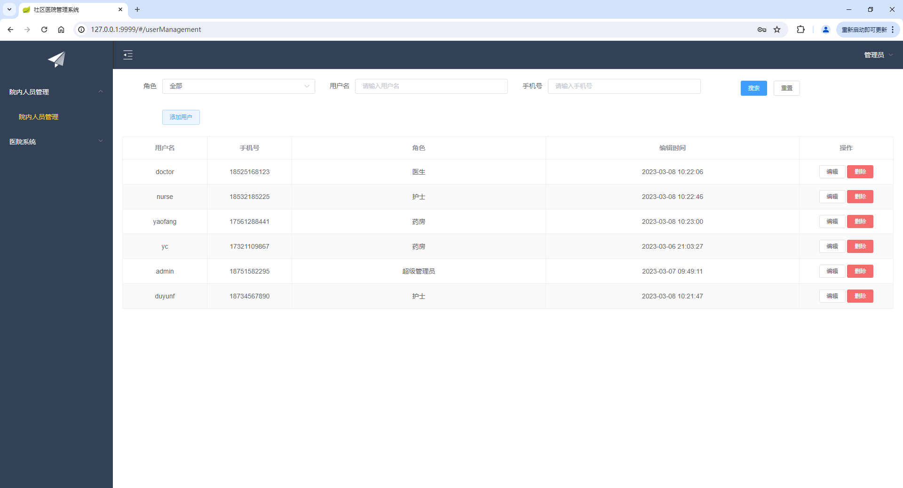

